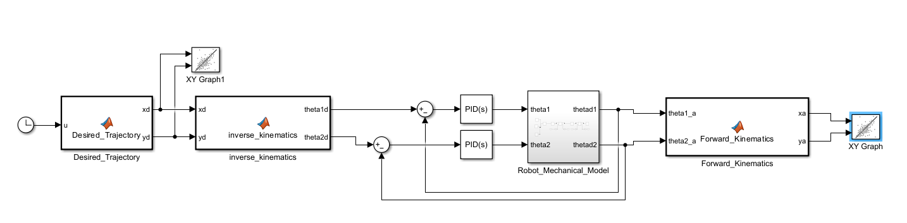
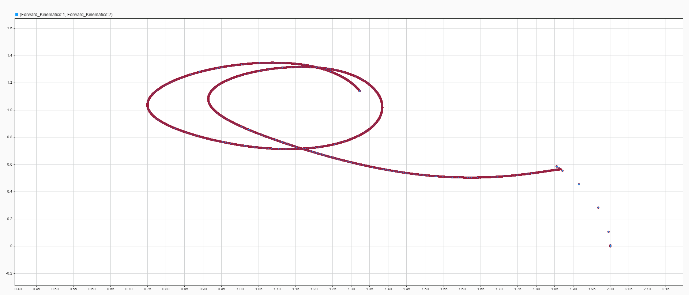
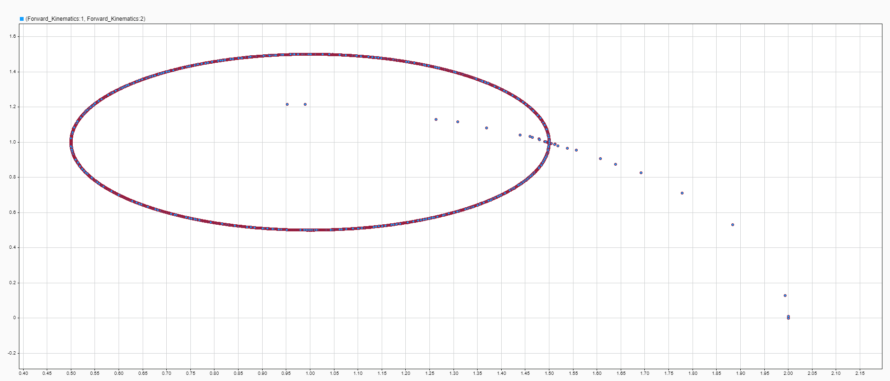

# Two-Link Robotic Arm - SolidWorks + MATLAB/Simulink

A **two-link robotic arm** designed in **SolidWorks** and imported into **MATLAB / Simscape Multibody** for dynamic simulation and PID-control analysis.

This project demonstrates a complete workflow from mechanical CAD geometry to multibody simulation and closed-loop control evaluation.

## PID Control Model

<p align="center">
  
</p>

## Response Comparison

| Without PID | With PID |
|---|---|
|  |  |

## Project Workflow

```text
SolidWorks CAD
      |
      v
Assembly / STEP Export
      |
      v
Simscape Multibody Import
      |
      v
Dynamic Simulation
      |
      v
PID Control
      |
      v
Response Analysis
```

## Repository Structure

```text
robotic-arm-simulation/
├── cad/
│   ├── solidworks/
│   └── step/
├── simulation/
└── results/
```

## Included Files

- Native SolidWorks parts and assembly
- STEP geometry
- Simscape Multibody model
- Generated physical-property data file
- PID diagram
- Input signal plot
- Response before PID control
- Response after PID control

Generated MATLAB cache folders such as `slprj` and `.slxc` are intentionally excluded because they can be regenerated locally.

## Skills Demonstrated

Mechanical CAD, SolidWorks assembly design, MATLAB, Simulink, Simscape Multibody, dynamic modeling, PID control, and response analysis.

---

**Author:** Mohamed Rasmy  
**Project type:** Robotics / Control Systems
